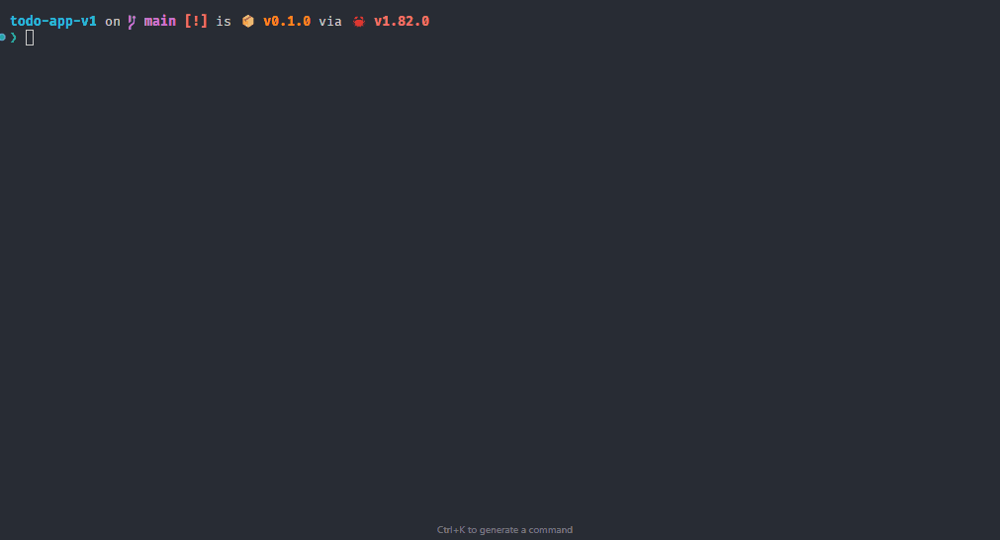

# RATATUI TODO APP

A simple todo app that I have created to learn more about rust.

## Features

- Add, edit, and delete todos
- Search/filter functionality
- Keyboard navigation
- Status bar with context help
- Confirmation dialogs
- Modal inference
- Clean UI with borders and titles

## Key Commands

- 'q': Quit
- '/': Search
- 'a': Add todo
- 'r': Remove todo
- 'i': Edit todo
- 'j'/'k' or arrows: Navigate
- Enter: Confirm
- Esc: Cancel/return to normal mode